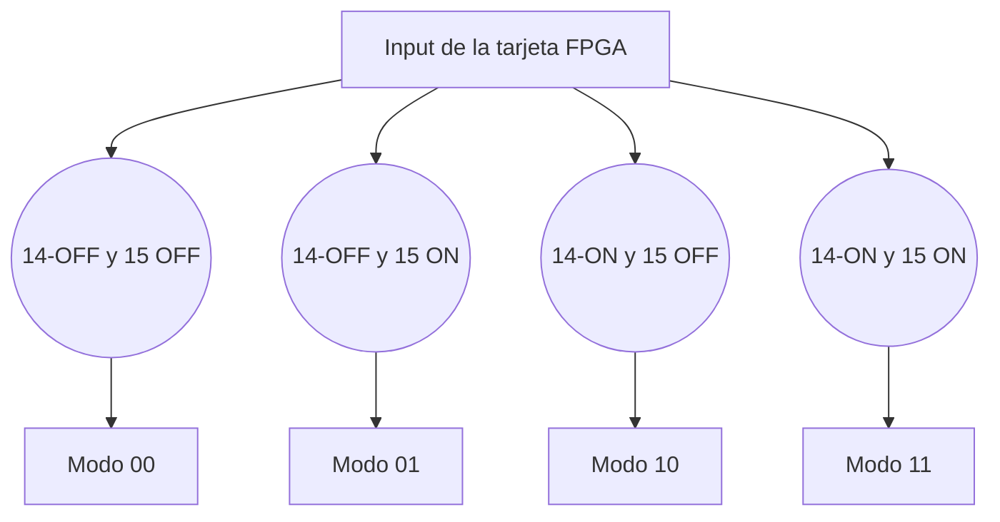
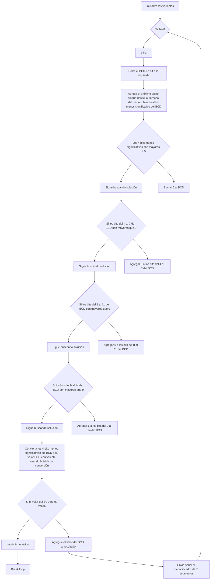
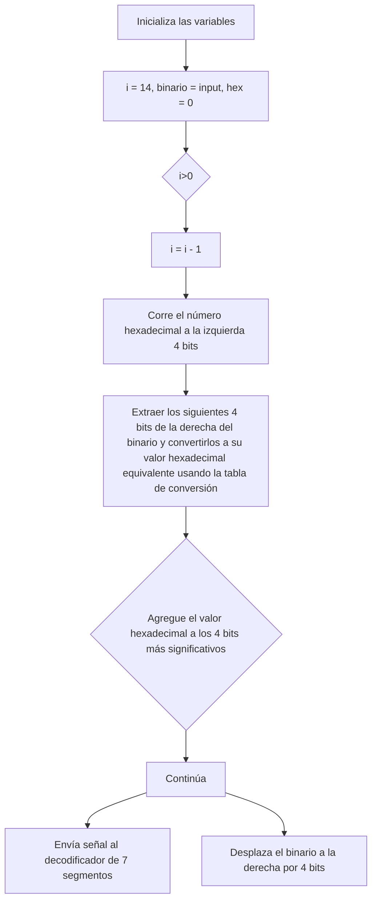

# Proyecto II - Introducción a diseño digital en HDL

## Introducción

El diseño digital es una disciplina que se enfoca en la creación de productos y servicios que se presentan en formato digital. Esto puede incluir desde sitios web y aplicaciones móviles hasta productos de realidad virtual y aumentada. El diseño digital es una parte integral de la era digital actual y es esencial para que las empresas y organizaciones conecten con su audiencia en línea.

## Modo de selección
Según el input del usuario utilizando los switches 14 y 15 de la tarjeta FPGA siendo 0 el estado apagado y 1 el estado encendido se seleccionará el modo de operación de entre los 4 posibles.

## Modo de lectura y sincronización

## Modo de cálculo de código BCD

## Modo de decodificado en display de 7 segmentos

## Modo 00 - Conversión de binario de 14 bits a  BCD

En el modo de operación 00. Calculará los dígitos de unidades, decenas, centenas y millares que se desplegarán en el panel de siete segmentos. 

## Modo 01 - Conversión de dos números binarios de 6 bits a BCD

Se realiza el mismo procedimiento de conversión de binario a BCD pero con dos números de 6 bits. Descartando los bits 13 y 6.

## Modo 10 - Despliegue de número binario de 14 bits en hexadecimal

Desplega el número sin signo de 14 bits en hexadecimal a través del 7 segmentos.

## Modo 11 - Código inversión de signo en complemento a dos de número binario de 14 bits en hexadecimal

Invierte el signo del número en complemento a dos y se desplegará el número con signo de 14 bits en hexadecimal a través del 7 segmentos.

## Análisis de principales problemas hallados durante el trabajo y de las soluciones aplicadas.

Dificultades en la comunicación entre las partes, falta de coherencia en el diseño entre las partes dificultando la implementación y conexión entre los distintos módulos creados por los integrantes del grupo y desconocimiento a la hora del uso de las herramientas necesarias para la creación del proyecto.
